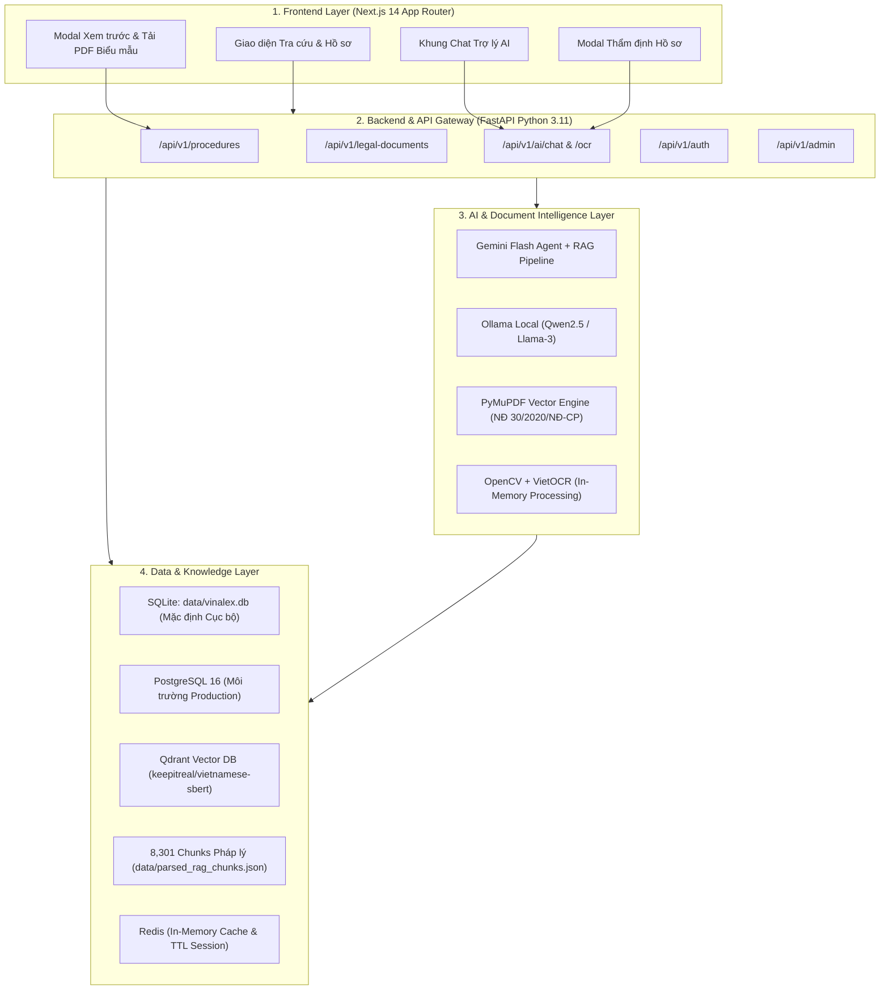

# VinaLex — Bản Thiết Kế Kiến Trúc Hệ Thống (Architecture Blueprint)

## Mục đích
Tài liệu này quy định kiến trúc tổng thể, luồng xử lý dữ liệu và danh sách công nghệ (Tech Stack) chuẩn mực của nền tảng **VinaLex**. Mọi thành viên trong đội ngũ phát triển cần nắm vững và tuân thủ chặt chẽ tài liệu này, đặc biệt là các quy chuẩn bảo mật thông tin theo Nghị định 13/2023/NĐ-CP và thể thức văn bản hành chính theo Nghị định 30/2020/NĐ-CP.

---

## 1. Cấu Trúc Các Lớp Công Nghệ (Tech Stack Layers)

### Lớp 1: Giao Diện Người Dùng (Frontend)
* **Framework:** Next.js 14 (React 18, TypeScript, CSS Modules).
* **Trải nghiệm:** Responsive, Dark/Light theme, thanh tìm kiếm thông minh hỗ trợ tiếng Việt không dấu, bộ đếm động theo danh mục thực tế.
* **Tương tác thông minh:**
  * Khung chat AI thời gian thực tích hợp nút tải file PDF trực tiếp.
  * Modal kiểm tra, đối soát giấy tờ (`DocumentVerificationModal`).
  * Modal xem trước và tải PDF biểu mẫu hành chính (`PdfPreviewModal`).

### Lớp 2: Giao Tiếp & Điều Phối (Backend / API Gateway)
* **Framework:** FastAPI (Python 3.11) chạy qua Uvicorn bất đồng bộ (`async`/`await`).
* **Khả năng chịu lỗi (Fault Tolerance):**
  * Tự động nhận diện CSDL SQLite cục bộ `data/vinalex.db` hoặc kết nối PostgreSQL.
  * Tự động kích hoạt cơ chế Fallback nạp JSON khi các dịch vụ ngoại vi chưa khởi động.

### Lớp 3: Trí Tuệ Nhân Tạo & Xử Lý Tài Liệu (AI & Document Engine)
1. **Phân hệ Trợ lý AI (Gemini Flash Agent & Ollama):**
   * Tích hợp kiến trúc RAG truy xuất căn cứ pháp lý từ 8.301 đoạn điều khoản pháp luật.
   * Nhận diện ý định xin biểu mẫu của người dân và tự động sinh metadata để kích hoạt tải PDF trực tiếp trong khung chat.
2. **Phân hệ Sinh Biểu Mẫu Hành Chính (PDF Template Engine):**
   * Sử dụng `fitz` (PyMuPDF) vẽ vector đơn sắc đen trắng chuẩn in ấn công quyền.
   * Tuân thủ Nghị định 30/2020/NĐ-CP: Quốc hiệu, Quốc huy/Tiêu ngữ, Tên mẫu biểu chuẩn (Mẫu 11/ĐK, Mẫu 04/ĐK, Mẫu 01/ĐK...).
   * Làm sạch 100% các từ ngữ thô/rác như câu hỏi thắc mắc, `[HỒ SƠ / BIỂU MẪU]`, `(NẾU CÓ)`.
3. **Phân hệ Thị Giác Máy & OCR (Computer Vision):**
   * `OpenCV`: Tiền xử lý ảnh tĩnh sau upload (khử nhiễu, cân bằng góc nghiêng).
   * `VietOCR`: Nhận diện ký tự tiếng Việt từ các vùng trường thông tin.

### Lớp 4: Lưu Trữ & Quản Lý Trạng Thái (Data & Storage)
* **CSDL Quan hệ:**
  * **SQLite (`data/vinalex.db`):** 556 thủ tục hành chính, 204 văn bản luật, sẵn sàng chạy ngay 1-click.
  * **PostgreSQL:** Hỗ trợ mở rộng quy mô lớn cho môi trường production.
* **Vector Database & RAG:** Qdrant Client và fallback ngữ liệu số hóa `data/parsed_rag_chunks.json`.
* **In-Memory Cache:** Redis dùng quản lý phiên tải file tạm thời và tự động hủy sau TTL (300 giây).

---

## 2. Sơ Đồ Luồng Dữ Liệu Xử Lý Hồ Sơ & Bảo Mật

Luồng hoạt động dưới đây mô tả quá trình từ lúc người dùng tải file lên đến lúc hệ thống xử lý xong và thực thi cơ chế xóa tự động:

---

## 3. 🚨 Quy Tắc Bảo Mật & Tuân Thủ Pháp Lý (Nghị định 13/2023/NĐ-CP)

Toàn bộ đội ngũ phát triển phải tuân thủ nghiêm ngặt các quy định sau nhằm bảo vệ dữ liệu cá nhân của người dân:

1. 🚫 **KHÔNG LƯU TRỮ TÀI LIỆU CÁ NHÂN LÊN Ổ CỨNG MÁY CHỦ:**
   Tài liệu tải lên (CCCD, sổ đỏ, đăng ký kinh doanh...) chỉ tồn tại trong bộ nhớ RAM (thông qua Redis) trong thời gian phiên làm việc (TTL 300 giây). Sau khi hoàn thành phân tích, hệ thống lập tức thu hồi và giải phóng bộ nhớ.
2. 🚫 **KHÔNG GHI LOG THÔNG TIN NHẠY CẢM:**
   Tuyệt đối không dùng `print()` hoặc ghi file log chứa thông tin cá nhân trích xuất được từ OCR (họ tên, số CCCD, địa chỉ, tài sản) ra màn hình console hay file log trên máy chủ.
3. 🔒 **BẢO MẬT PHÂN QUYỀN ADMIN:**
   Mọi endpoint quản trị CMS (`/api/v1/admin/*`) bắt buộc phải được bảo vệ bằng header bí mật `X-Admin-Key`.