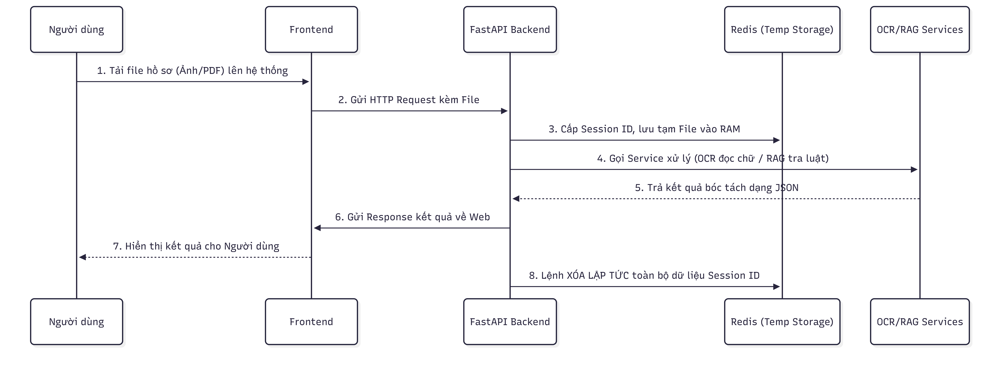

# VinaLex - Bản Thiết kế Kiến trúc Hệ thống (Architecture Blueprint)

## Mục đích
Tài liệu này quy định kiến trúc tổng thể, luồng xử lý dữ liệu và danh sách các công nghệ/công cụ (Tech Stack) bắt buộc phải sử dụng trong dự án VinaLex. Mọi thành viên trong đội ngũ phát triển phải đọc hiểu và tuân thủ chặt chẽ tài liệu này trước khi viết code, đặc biệt là các quy tắc về bảo mật thông tin.

---

## 1. Cấu trúc Các lớp Công nghệ (Tech Stack Layers)
Hệ thống được chia thành 4 lớp rõ rệt, kết nối với nhau thông qua API:

### Lớp 1: Giao diện Người dùng (Frontend)
* **Next.js (React):** Quản lý luồng tương tác người dùng, hiển thị nội dung thủ tục hành chính, giao diện tải file và khung chat trợ lý ảo.

### Lớp 2: Giao tiếp & Điều phối (Backend / API Gateway)
* **FastAPI (Python 3.11):** Bắt buộc sử dụng làm Backend lõi. Đảm nhiệm việc tiếp nhận các request từ Frontend, phân luồng tác vụ và xử lý bất đồng bộ (async/await) để không gây nghẽn hệ thống khi các mô hình AI đang chạy.

### Lớp 3: Trí tuệ Nhân tạo & Bóc tách Dữ liệu (AI Services)
Được đóng gói thành các Class (OOP) gọi từ FastAPI, bao gồm 2 phân hệ:
* **Phân hệ Thị giác máy (CV/OCR - Xử lý file ảnh tĩnh):**
  * `OpenCV`: Tiền xử lý file ảnh tải lên (cắt, xoay, làm nét).
  * `YOLO-OBB`: Phân tích bố cục, khoanh vùng chính xác các trường thông tin (tên, ngày sinh, chữ ký).
  * `VietOCR`: Trích xuất ký tự tiếng Việt từ các vùng đã cắt.
* **Phân hệ Xử lý Ngôn ngữ Tự nhiên (RAG):**
  * `LangChain`: Khung sườn liên kết các module NLP.
  * `Qdrant` (ưu tiên) hoặc `ChromaDB`: Cơ sở dữ liệu Vector lưu trữ tài liệu luật.
  * `Ollama`: Môi trường chạy các mô hình ngôn ngữ lớn (Qwen2.5, Llama-3).

### Lớp 4: Lưu trữ & Quản lý Trạng thái (Storage)
* **PostgreSQL:** Lưu trữ dữ liệu hệ thống (Tài khoản, danh sách bài viết thủ tục).
* **Redis:** Bắt buộc sử dụng làm vùng nhớ tạm (In-memory cache) cho các file ảnh tải lên và phiên làm việc (session).

---

## 2. Sơ đồ Luồng Dữ liệu Xử lý Hồ sơ (Data Flow)

Luồng hoạt động dưới đây mô tả quá trình từ lúc người dùng tải file lên đến lúc hệ thống xử lý xong và thực thi cơ chế xóa tự động.

